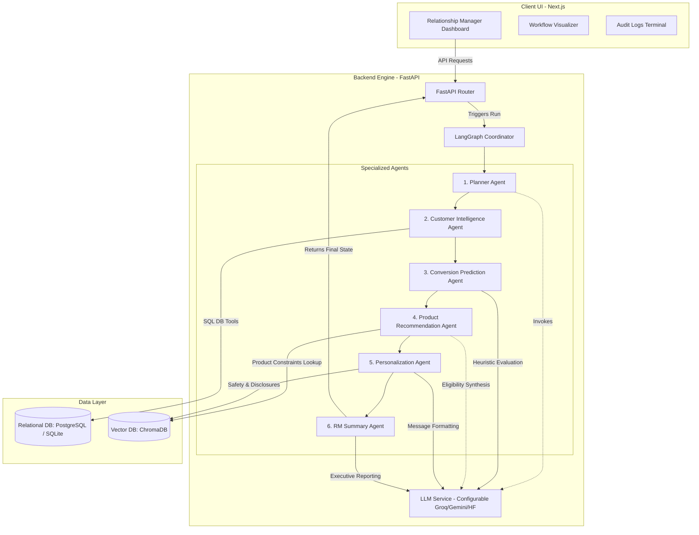

# Architecture Diagrams

This document contains detailed architecture and process flow diagrams for the BFSI Agentic Banking CRM system.

## 1. System Architecture

The CRM platform follows an AI-first full-stack design. A Next.js frontend communicates with a FastAPI backend server. The backend orchestrates a LangGraph state machine containing 6 specialized agents, querying a PostgreSQL/SQLite relational database for structured customer history and ChromaDB for vector-indexed underwriting constraints and CRM notes.



## 2. Agent Workflow & State Machine

The orchestration uses LangGraph to manage state transitions. Each node represents a single agent's execution phase, modifying the shared workflow state before forwarding execution.

```mermaid
stateDiagram-v2
    [*] --> Planner : Receives RM Query
    
    state Planner {
        [*] --> ParseQuery
        ParseQuery --> FormulateStrategy : Identify Campaign Targets
        FormulateStrategy --> [*]
    }
    
    Planner --> CustomerIntelligence : Planner Instructions
    
    state CustomerIntelligence {
        [*] --> QueryCRMNotes : Vector similarity notes check
        QueryCRMNotes --> QuerySQLDB : Demographic & income lookup
        QuerySQLDB --> CompileFinancials : Summarize txn ledger & EMIs
        CompileFinancials --> ScoreCustomerValue : Calculate Value (0-100)
        ScoreCustomerValue --> [*]
    }
    
    CustomerIntelligence --> ConversionPrediction : Customer IDs & Financials
    
    state ConversionPrediction {
        [*] --> RunBusinessRules : Apply +/- scoring modifiers
        RunBusinessRules --> ValidateWithLLM : Run logic check
        ValidateWithLLM --> [*]
    }
    
    ConversionPrediction --> ProductRecommendation : Conversion Scores
    
    state ProductRecommendation {
        [*] --> RetrieveBankPolicies : Query product sheets from Chroma
        RetrieveBankPolicies --> MapCreditCriteria : Align age, income & liabilities
        MapCreditCriteria --> AssignBestFit : Recommended Product
        AssignBestFit --> [*]
    }
    
    ProductRecommendation --> Personalization : Product Matches
    
    state Personalization {
        [*] --> DraftWhatsAppCopy : Emojis & concise CTA
        DraftWhatsAppCopy --> DraftEmailCopy : Structured formal body
        DraftEmailCopy --> InjectDisclosures : Apply BFSI legal warnings
        InjectDisclosures --> [*]
    }
    
    Personalization --> RMSummary : Outreach Templates
    
    state RMSummary {
        [*] --> RankCandidates : Combined Conversion & Value score
        RankCandidates --> GenerateStats : Average probability & dominant product
        GenerateStats --> WriteExecutiveOverview : Compose RM Summary paragraph
        WriteExecutiveOverview --> [*]
    }
    
    RMSummary --> [*] : Return campaign dossier
```



## 3. Scoring Formulas & Heuristics

The system implements rule-based models for evaluation metrics, ensuring explainability.

### A. Customer Value Score (0 - 100)
The value score represents the customer's asset value to the bank:
$$\text{value\_score} = 0.40 \cdot \text{Income Score} + 0.35 \cdot \text{Balance Score} + 0.25 \cdot \text{Relationship Score}$$

Where:
* **Income Score** (40% Weight): Maxes out at an annual income of \$250,000.
  $$\text{Income Score} = \min\left(\frac{\text{Annual Income}}{250000}, 1.0\right) \cdot 100$$
* **Balance Score** (35% Weight): Maxes out at an average balance of \$100,000.
  $$\text{Balance Score} = \min\left(\frac{\text{Average Monthly Balance}}{100000}, 1.0\right) \cdot 100$$
* **Relationship Score** (25% Weight): Maxes out at 10 years of banking relationship.
  $$\text{Relationship Score} = \min\left(\frac{\text{Relationship Years}}{10}, 1.0\right) \cdot 100$$

---

### B. Conversion Probability (5% - 95%)
The conversion probability is initialized at a base of **40.0%** and adjusted using financial triggers:
1. **Salary Credit Regularity**: $+15\%$ if salary is deposited regularly monthly.
2. **Balance Tier**:
   - $+20\%$ if average monthly balance is $\ge \$25,000$.
   - $-20\%$ if average monthly balance is $< \$5,000$.
3. **Previous Inquiries**: $+25\%$ if historical CRM notes contain keywords matching the campaign product.
4. **Engagement Frequency**: $+10\%$ if customer registers $\ge 3$ interactions in the last 6 months.
5. **Debt Burden (DTI)**: $-20\%$ if monthly EMI liabilities represent $> 30\%$ of monthly gross income.
6. **Dormancy**: $-30\%$ if customer has 0 active interactions in the last 6 months.

The final score is bound between a minimum of **5%** and a maximum of **95%**.

---

## 4. Explainability & State Output

Every decision is traceable. For example, the `Conversion Prediction Agent` outputs:

```json
{
  "customer_id": "102",
  "conversion_probability": 88.0,
  "reasons": [
    "Salary credited regularly (+15%)",
    "High balance maintained ($18,450) (+20%)",
    "Previous CRM inquiries related to target product (loan) detected (+25%)",
    "Customer conversion probability is estimated at 88% because of steady salary inflows and active inquiries."
  ]
}
```

---

## 5. Architectural Trade-offs: ChromaDB vs relational SQL
Reviewers may ask why the system uses ChromaDB instead of querying SQL directly:
- **Relational SQL Database** (SQLite/PostgreSQL) is used for structured transaction ledgers and customer demographic fields.
- **ChromaDB Vector Store** is used for:
  1. **Unstructured CRM Notes**: Free-text conversation logs that require semantic search (e.g. finding customers expressing "interest in buying a home" without exact string matching).
  2. **Product Catalog & Policies**: Unstructured policy PDF sheets used to confirm underwriting conditions through vector similarity matches.

