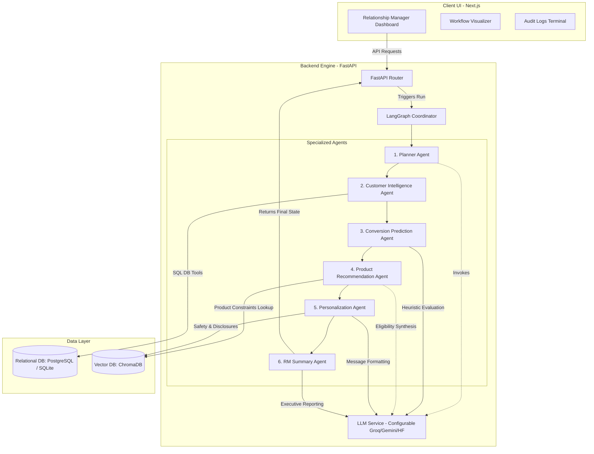

# Architecture Diagrams

This document contains detailed architecture and process flow diagrams for the BFSI Agentic Banking CRM system.

## 1. System Architecture

The CRM platform follows an AI-first full-stack design. A Next.js frontend communicates with a FastAPI backend server. The backend orchestrates a LangGraph state machine containing 6 specialized agents, querying a PostgreSQL/SQLite relational database for structured customer history and ChromaDB for vector-indexed underwriting constraints and CRM notes.

## 2. Agent Workflow & State Machine

The orchestration uses LangGraph to manage state transitions. Each node represents a single agent's execution phase, modifying the shared workflow state before forwarding execution.

```mermaid
stateDiagram-v2
    [*] --> Planner : Receives RM Query
    
    state Planner {
        [*] --> ParseQuery
        ParseQuery --> FormulateStrategy : Identify Campaign Targets
        FormulateStrategy --> [*]
    }
    
    Planner --> CustomerIntelligence : Planner Instructions
    
    state CustomerIntelligence {
        [*] --> QueryCRMNotes : Vector similarity notes check
        QueryCRMNotes --> QuerySQLDB : Demographic & income lookup
        QuerySQLDB --> CompileFinancials : Summarize txn ledger & EMIs
        CompileFinancials --> ScoreCustomerValue : Calculate Value (0-100)
        ScoreCustomerValue --> [*]
    }
    
    CustomerIntelligence --> ConversionPrediction : Customer IDs & Financials
    
    state ConversionPrediction {
        [*] --> RunBusinessRules : Apply +/- scoring modifiers
        RunBusinessRules --> ValidateWithLLM : Run logic check
        ValidateWithLLM --> [*]
    }
    
    ConversionPrediction --> ProductRecommendation : Conversion Scores
    
    state ProductRecommendation {
        [*] --> RetrieveBankPolicies : Query product sheets from Chroma
        RetrieveBankPolicies --> MapCreditCriteria : Align age, income & liabilities
        MapCreditCriteria --> AssignBestFit : Recommended Product
        AssignBestFit --> [*]
    }
    
    ProductRecommendation --> Personalization : Product Matches
    
    state Personalization {
        [*] --> DraftWhatsAppCopy : Emojis & concise CTA
        DraftWhatsAppCopy --> DraftEmailCopy : Structured formal body
        DraftEmailCopy --> InjectDisclosures : Apply BFSI legal warnings
        InjectDisclosures --> [*]
    }
    
    Personalization --> RMSummary : Outreach Templates
    
    state RMSummary {
        [*] --> RankCandidates : Combined Conversion & Value score
        RankCandidates --> GenerateStats : Average probability & dominant product
        GenerateStats --> WriteExecutiveOverview : Compose RM Summary paragraph
        WriteExecutiveOverview --> [*]
    }
    
    RMSummary --> [*] : Return campaign dossier
```

