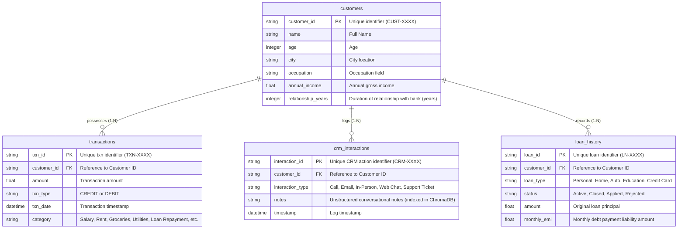

# Database Relationships Schema

The database model is configured using SQLAlchemy, supporting SQLite for local testing and PostgreSQL for enterprise staging/production.

```mermaid
erDiagram
    customers ||--o{ transactions : "possesses (1:N)"
    customers ||--o{ crm_interactions : "logs (1:N)"
    customers ||--o{ loan_history : "records (1:N)"

    customers {
        string customer_id PK "Unique identifier (CUST-XXXX)"
        string name "Full Name"
        integer age "Age"
        string city "City location"
        string occupation "Occupation field"
        float annual_income "Annual gross income"
        integer relationship_years "Duration of relationship with bank (years)"
    }

    transactions {
        string txn_id PK "Unique txn identifier (TXN-XXXX)"
        string customer_id FK "Reference to Customer ID"
        float amount "Transaction amount"
        string txn_type "CREDIT or DEBIT"
        datetime txn_date "Transaction timestamp"
        string category "Salary, Rent, Groceries, Utilities, Loan Repayment, etc."
    }

    crm_interactions {
        string interaction_id PK "Unique CRM action identifier (CRM-XXXX)"
        string customer_id FK "Reference to Customer ID"
        string interaction_type "Call, Email, In-Person, Web Chat, Support Ticket"
        string notes "Unstructured conversational notes (indexed in ChromaDB)"
        datetime timestamp "Log timestamp"
    }

    loan_history {
        string loan_id PK "Unique loan identifier (LN-XXXX)"
        string customer_id FK "Reference to Customer ID"
        string loan_type "Personal, Home, Auto, Education, Credit Card"
        string status "Active, Closed, Applied, Rejected"
        float amount "Original loan principal"
        float monthly_emi "Monthly debt payment liability amount"
    }
```
